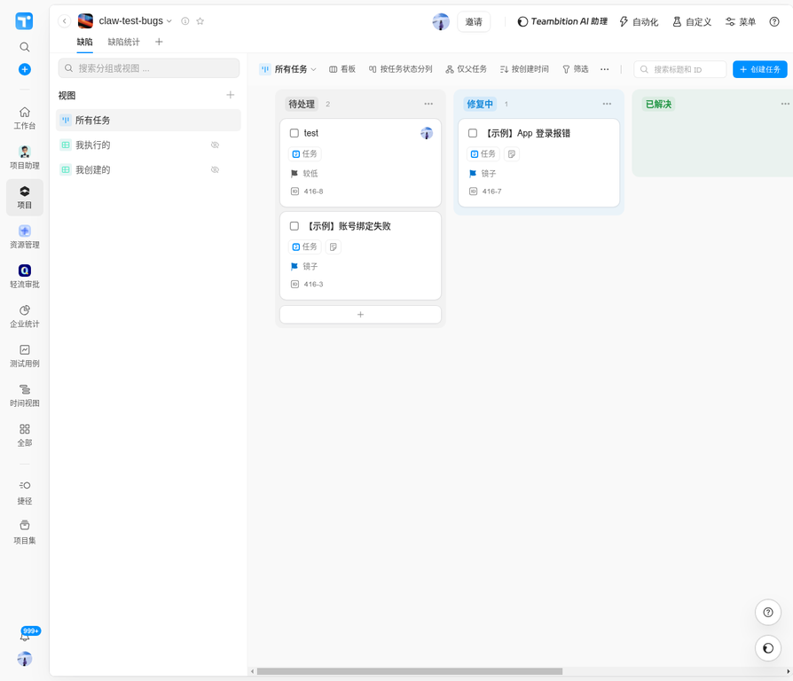
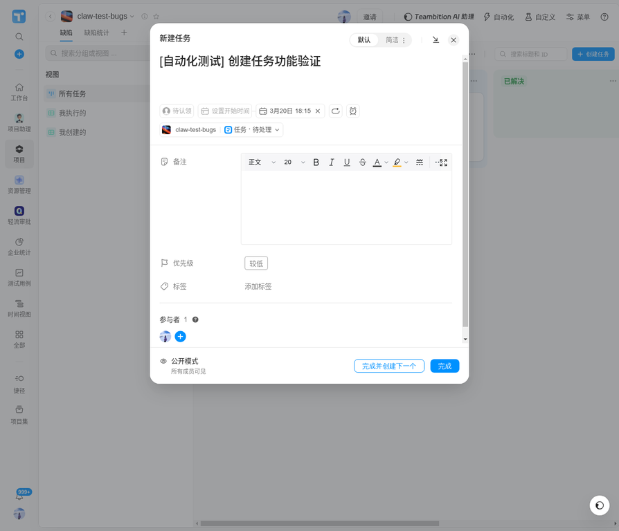
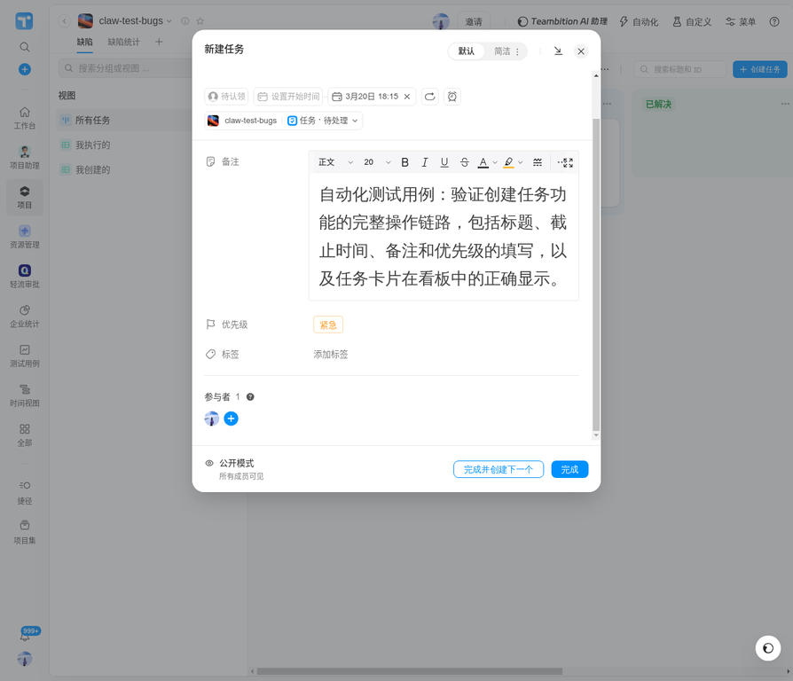
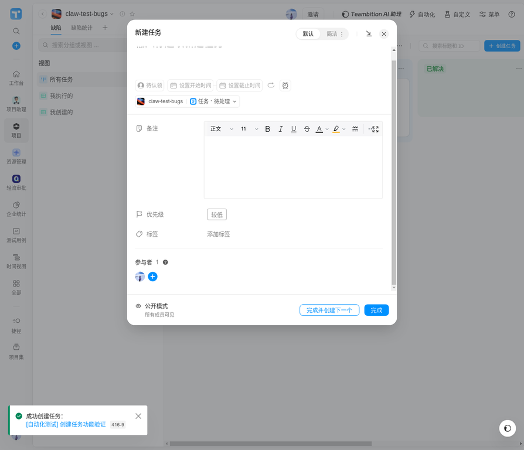

# Teambition 自动化功能测试报告

**项目**：claw-test-bugs（一起玩 TB 专属版）  
**测试功能**：创建任务  
**执行时间**：2026-03-04  
**执行方式**：Playwright MCP 浏览器自动化  
**测试结论**：**通过 ✅**

---

## 一、测试概览

| 项目 | 内容 |
|---|---|
| 应用地址 | https://www.teambition.com/project/69a7ce486cb8d6136c533249 |
| 测试功能 | 创建任务（含标题、截止时间、备注、优先级） |
| 用例总数 | 5 个步骤验证点 |
| 通过数 | 5 |
| 失败数 | 0 |
| 通过率 | **100%** |

---

## 二、测试环境

| 项目 | 内容 |
|---|---|
| 浏览器 | Chromium（Playwright MCP 驱动） |
| 登录方式 | 用户手动扫码登录（钉钉 OAuth），Agent 接管后续操作 |
| 测试数据 | 任务标题：`[自动化测试] 创建任务功能验证` |
| 截止时间 | 2026-03-20 |
| 备注 | 自动化测试用例：验证创建任务功能的完整操作链路，包括标题、截止时间、备注和优先级的填写，以及任务卡片在看板中的正确显示。 |
| 优先级 | 紧急 |

---

## 三、测试步骤与截图

### 步骤一：进入项目看板（前置状态）

**操作**：导航至 `claw-test-bugs` 项目，确认看板正常加载。  
**预期**：看板显示「待处理」「修复中」「已解决」三列，共 2 个已有任务。  
**实际**：看板加载成功，「待处理」列显示 2 个任务（test、【示例】账号绑定失败），「修复中」列 1 个任务（【示例】App 登录报错）。  
**结果**：✅ 通过

---

### 步骤二：点击「创建任务」按钮，弹窗打开

**操作**：点击看板右上角的「+ 创建任务」按钮。  
**预期**：弹出「新建任务」弹窗，包含标题输入框、时间设置、备注、优先级等字段。  
**实际**：弹窗正常弹出，标题输入框获得焦点，所有字段均可见。  
**结果**：✅ 通过（验证点一达成）

---

### 步骤三：填写任务标题与截止时间

**操作**：在标题框输入 `[自动化测试] 创建任务功能验证`，点击「设置截止时间」选择 3 月 20 日。  
**预期**：标题正确显示，截止时间显示为「3月20日 18:15」。  
**实际**：标题填写成功；截止时间通过日历选择器选定 3 月 20 日，确认后显示「3月20日 18:15」。  
**结果**：✅ 通过

---

### 步骤四：填写备注并设置优先级

**操作**：在备注富文本区域输入测试说明，点击优先级「较低」标签，从下拉菜单中选择「紧急」。  
**预期**：备注区域显示输入内容，优先级标签更新为橙色「紧急」。  
**实际**：备注内容填写成功；优先级下拉菜单正常展开，选择「紧急」后标签变为橙色「紧急」。  
**结果**：✅ 通过

---

### 步骤五：点击「完成」提交，验证 Toast 与看板卡片

**操作**：点击弹窗右下角「完成」按钮提交任务。  
**预期**：  
1. 左下角出现绿色 Toast 提示「成功创建任务：[自动化测试] 创建任务功能验证」  
2. 看板「待处理」列出现新任务卡片，显示任务标题、截止日期「3月20日 截止」、优先级「紧急」

**实际**：  
1. 左下角出现绿色 Toast：「✅ 成功创建任务：[自动化测试] 创建任务功能验证 416-9」  
2. 看板「待处理」列任务数从 2 变为 3，新卡片「[自动化测试] 创建任务功能验证」出现在列首，显示「3月20日 截止」「紧急」标签，任务 ID 为 416-9  

**结果**：✅ 通过（验证点二达成）

---

## 四、测试结果汇总

| 验证点 | 预期结果 | 实际结果 | 状态 |
|---|---|---|---|
| 点击「创建任务」后弹出弹窗 | 弹窗正常打开，所有字段可见 | 弹窗正常打开 | ✅ 通过 |
| 标题输入 | 正确显示输入内容 | 正确显示 | ✅ 通过 |
| 截止时间设置 | 显示「3月20日 18:15」 | 显示「3月20日 18:15」 | ✅ 通过 |
| 备注填写 | 富文本区域正确显示内容 | 正确显示 | ✅ 通过 |
| 优先级设置 | 标签变为橙色「紧急」 | 变为橙色「紧急」 | ✅ 通过 |
| 提交后 Toast 提示 | 左下角出现成功创建提示 | 出现「✅ 成功创建任务」Toast | ✅ 通过 |
| 看板卡片出现 | 「待处理」列出现新卡片，含标题、截止日期、优先级 | 卡片正确出现，ID 416-9 | ✅ 通过 |

---

## 五、测试结论

**创建任务功能完整链路测试通过（7/7 验证点全部达成）。**

本次测试覆盖了从点击入口按钮到任务卡片出现在看板的完整操作链路，包括弹窗交互、多字段填写（标题、截止时间、备注、优先级）、表单提交、Toast 反馈和看板状态更新，所有环节均符合预期行为，未发现功能异常。

---

## 六、附件截图索引

| 文件名 | 内容说明 |
|---|---|
| `step02_create_dialog_opened.png` | 看板初始状态（测试前置） |
| `step03_due_date_set.png` | 截止时间设置成功 |
| `step05_priority_set.png` | 备注填写完成 + 优先级设为「紧急」 |
| `step06_task_created_toast.png` | 提交成功：Toast 提示 + 新任务卡片出现在看板 |

---

*报告由 Manus AI 通过 Playwright MCP 自动化测试生成 · 2026-03-04*
